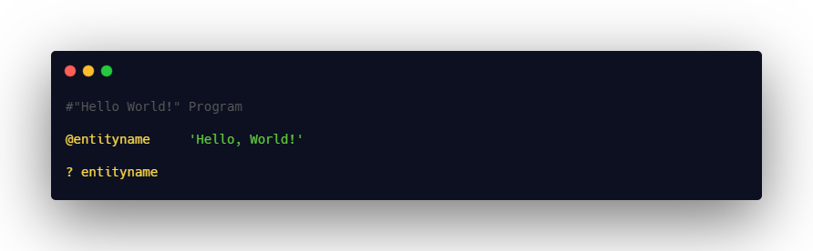
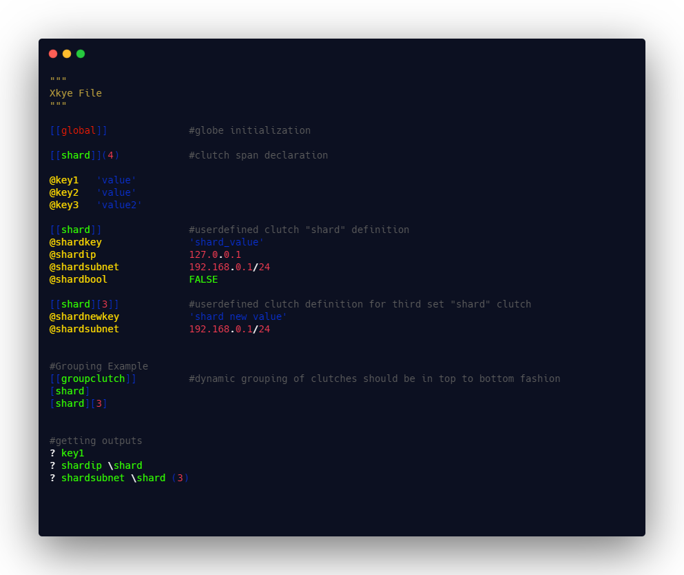

# Xkye Language

<p align="center">
<a href="xky logo"></a>
</p>

**Xkye** (pronounced: **/skaɪ/**) is an Open source, minimal, keyword less configuration file language that consists of text-based content with a structure and syntax comprising majorly key-value pairs. Thus the name **Xkye** is the anagram of the word **key-x** denoting keys which can have any values. These files can be used to store and retrieve individual or group of configuration settings for any application development. The **Xkye** file will go generally with the file extension **.xye**. Xkye is a keyword less language we can use any identifier names except ***[global](doc/Globe.md)***

Xkye was created as an extended version of ***.ini*** format with more flexibility over reusing the ***entities*** and the group of entities called ***clutches***. You can use any IDE or text editor to open this file.

</br>

[](https://forthebadge.com)
[](https://forthebadge.com)
[](https://forthebadge.com)
[](https://forthebadge.com)


## Xkye file extension rules
- Xkye files extension is .xky by default
- File supports UTF-8 encoding format
- Supports whitespaces, tabs and newlines ascii code
- MIME Format type - text/plain

<br />


<br />

## Standard Library list
- [xkye_python](https://github.com/RahmanAnsari/xkye_python) standard python library for xkye language

<br />

## Syntax Highlighting Scripts
Work in progress

<br />

## Build environment requirements

Xkye is built using antlr4, so in order to build Xkye lexer and parser for various languages you need to have Java environment installed.

### Java version verification

#### To make sure you have Java installed. Check it with

<br />

```sh
java -version
```

### Antlr4 Installation

We can install antlr4 using any of the following methods:

#### Using the package manager

Modern Linux distros already include a package for ANTLR

```sh
sudo apt-get install antlr4
```

#### Getting the Jar files

```sh
# Download antlr4 jar file to /usr/local/lib
cd /usr/local/lib
sudo wget http://www.antlr.org/download/antlr-4.9-complete.jar
```

You will also need to create a command file that will ease the call to Antlr4. Edit a file named antlr4 and write into it:

```sh
export CLASSPATH=".:/usr/local/lib/antlr-4.9-complete.jar:$CLASSPATH"
alias antlr4='java -jar ~/Desktop/entityx/antlr-4.9-complete.jar'
alias grun='java org.antlr.v4.gui.TestRig'
```

save the file, and give it execution permission:

```sh
chmod +x antlr4
```

finally, move it to a folder in the default PATH

```sh
sudo mv antlr4 /usr/local/bin
```

For the complete instruction about the installation of above mentioned packages for other operating system, please find the official documentation of [java](https://www.java.com/en/download/) and [antlr4](https://www.antlr.org/) here.

## Building

You can generate the parsers and lexers for our xkye.g4 file using the below command,

```sh
git clone https://github.com/RahmanAnsari/xkye-lang.git 

antlr4 Xkye.g4
```

You can then use the below command to test each component in xkye language

```sh
grun Xkye <component name> -tree
```

For more details, kindly check the official antlr4 documentation

## Getting Started
A basic **Hello, World!** program in xkye language can be expressed concisely in just one or two lines as below:



The output of the above [script](examples/helloworld.xky) will be
```sh
Hello, World!
```

## Format
Further details regarding syntax and structure of xkye language is explained in xkye's docs.
- [Pair](doc/Xkyepair.md)
- [Comment](doc/Comment.md)
- [Clutch](doc/Clutch.md)
- [Globe](doc/Globe.md)
- [Fetch](doc/Fetch.md)


## Status
***Xkye*** is currently in its 1<sup>st</sup> major version, I will try to semi-regularly introduces breaking changes. These changes will be usually fairly easy to adapt to. The up-to-date grammar file [xkye.g4](Xkye.g4) is included in this repository. You can use this file to generate the lexers and parsers for various languages using antlr4.

## Demo
Below is the basic syntax of the complete demo.xye file with all its components,



The output of the above script will be

```sh
value
127.0.0.1
192.168.0.0/24
```

You can easily copy paste the code using the [Demo.xky](examples/demo.xky) file included in the repository

## Xkye in action
Currently various applications using xkye in the contexts of configuration are in development phases, one of such is [GrubChirp](https://github.com/grubchirp)

## Advantages of Xkye file
- It is human readable for simple configuration and settings
- Supports Comments
- Maintainable
- Read and write capabilities
- Content of this files looks like windows init & Ini file format

## Disadvantages
- Numbers like NAN and infinity are not supported
- No support for binary data
- Complex values ike table are not supported

## XKYE use cases
- Xkye can be used in many type of projects for configuration settings
- Configuration and settings of the software applications

## Contributing
We welcome all contributions to Xkye regardless of how small or large they are. Everything from spelling fixes to new feature to be included in the structure and syntax are welcomed and appreciated. You can find our [Contributing Guidelines](https://github.com/RahmanAnsari/xkye-lang/tree/master/CONTRIBUTING.md) here.

If you are not familiar with making a pull request using GitHub and/or git, please read [this guide](https://docs.github.com/en/github/collaborating-with-pull-requests/proposing-changes-to-your-work-with-pull-requests/about-pull-requests). If you're looking for ways to contribute, please look at our [issue tracker](https://github.com/RahmanAnsari/xkye-lang/issues).

## Upcoming features on or before v2.0.0
- [ ] Ability to add IPV6 address
- [ ] Inclusion of import statement for multi file support
- [ ] Addition of escape character for better string manipulation

## Code of conduct
This project and everyone participating in it will be governed by the [Xkye Code of Conduct](CODE_OF_CONDUCT.md). By participating, you are expected to uphold this code. Please report unacceptable behavior to my email.

## Legal
Xkye is open-source language specification that is released under the MIT License. For details on the license, see the [LICENSE](https://github.com/RahmanAnsari/xkye-lang/blob/main/LICENSE) file.

---

If you like this library, help me to develop it by buying a cup of coffee

<a href="https://www.buymeacoffee.com/rahmanansari" target="_blank"></a>

</br>


