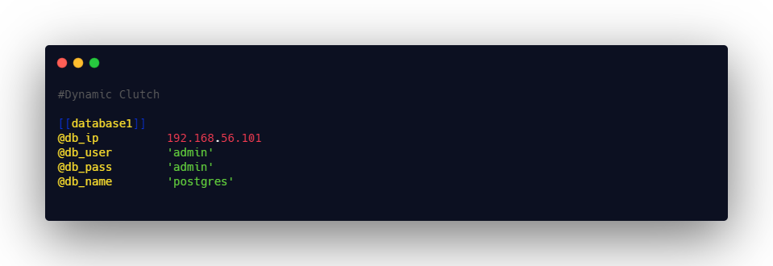
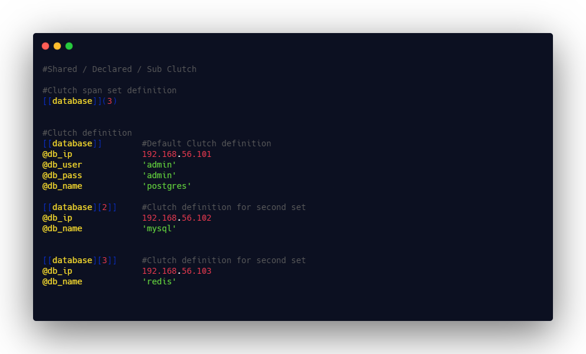
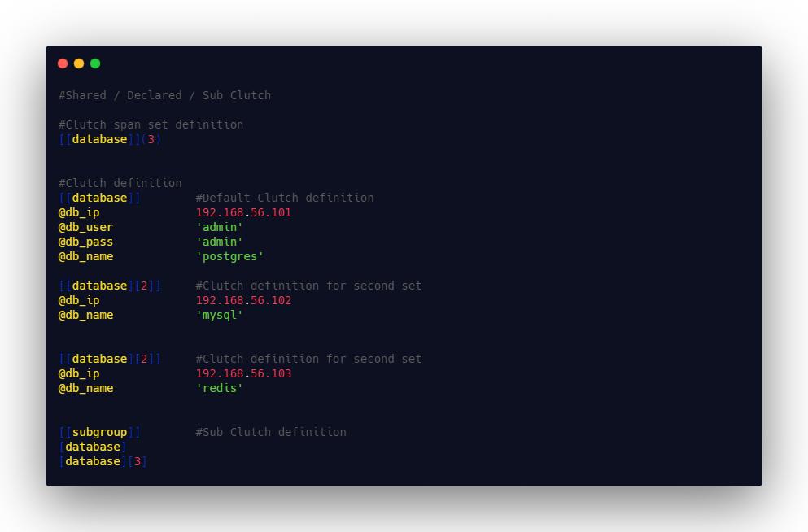

# Xkye Clutch

Clutch in Xkye is a collection of Entity value pairs grouped together under a single name. Each clutch must have a clutch header followed by group of Xkye pairs.

Clutch can be used in three different ways,

### Dynamic clutches

Dynamic clutches are group of pairs under a same hood, which cannot be reused.




```sh

[[clutch_name]]
#....
#key values pairs

```

### Pre declared clutches
Xkye lets you have the ability to have multiple version of same clutches for different usages. But these pre declared clutches must be declared before assigning it.

```sh

[[clutch_name]](2)

[[clutch_name]]
#....
#key values pairs


[[clutch_name][2]]
#....
#key values pairs

```

In the above examples, two databases are configured for connection. Since both the databases are having same username and password, it will automatically called when we call the user name of the second database definition. Please use [Fetch](doc/Fetch.md) document for ways to get the values of the corresponding keys.




### Sub clutches
Sub clutches are nothing but clutches which are used to group the clutch itself. Sub clutch inherits all the properties of the pre declared clutches. If two clutches inside the same sub clutch having a same entity values pairs, values of the second entity will be used. all the clutches grouped under the subclutch must be already defined

```sh
[[subclutch_name]]
[clutch_name]
[clutch_name](2)
```




### Rules

- Clutch name follows the same rules as [Entity](Xkyepair.png)
- Each clutch header must be enclosed within a two square brackets
- Dynamic clutches cannot have a pairs with same entity name twice
- Syntax will differ a bit while accessing Pre declared clutches & while declaring clutch spans.
- Clutch declaration will have a span set value enclosed with in a parenthesis which is placed next to the clutch name.
- Clutch span must be ***integer number*** larger than zero ***0***
- if the clutch is declared and not defined, default values will be fetched for undeclared clutches
- Each declared clutch must have a default clutch
- Default clutch must not have a span set value
- Clutch definition of a pre declared set other than default clutch must have a ***span value set*** enclosed within the outer square brackets.
