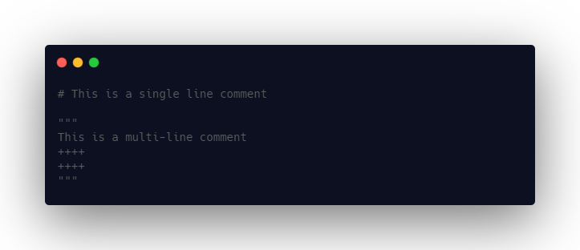

# Xkye Comments

Xkye supports both single line & multi line comments.

- Single line comments are preceded with #
- Multi line comments are preceded and ended with triple quotes """
- Single line comments can also be an inline comment.

Please find the examples below,

