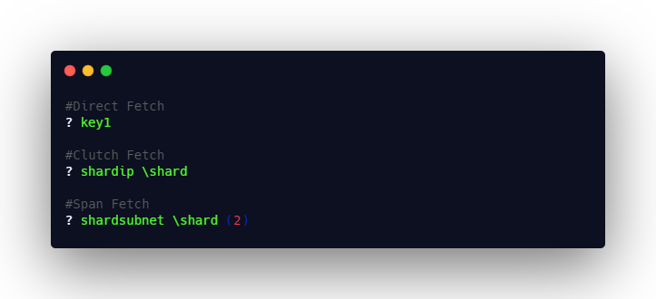

# Fetch

Fetch format is used to fetch the defined entities in the xkye language. Fetch can be used in multi level. A basic syntax of the fetch is entity name preceded with a question mark ***?***


There are three levels of Fetches available in Xkye,

### Direct Fetch
Direct fetch is used to get the values of the entity declared without any clutches are if it is under global clutch.

```sh
#Direct Fetch														
? key1
```

### Clutch Fetch
Clutch fetch will be used to fetch the entity values declared under any specified clutches or default clutch. In clutch fetch, **question mark** is used to call the entity and **backslash** is used to call the clutch.

```sh
#Clutch Fetch
? shardip \shard
```


### Span Fetch
Span Fetch will be used to fetch the entity values declared under the clutch of the specified span set. In clutch fetch, **?** is used to call the entity, **backslash** is used to call the clutch along with **span set value** is defined within a parenthesis.

```sh
#Span Fetch
? shardsubnet \shard (2)
```



