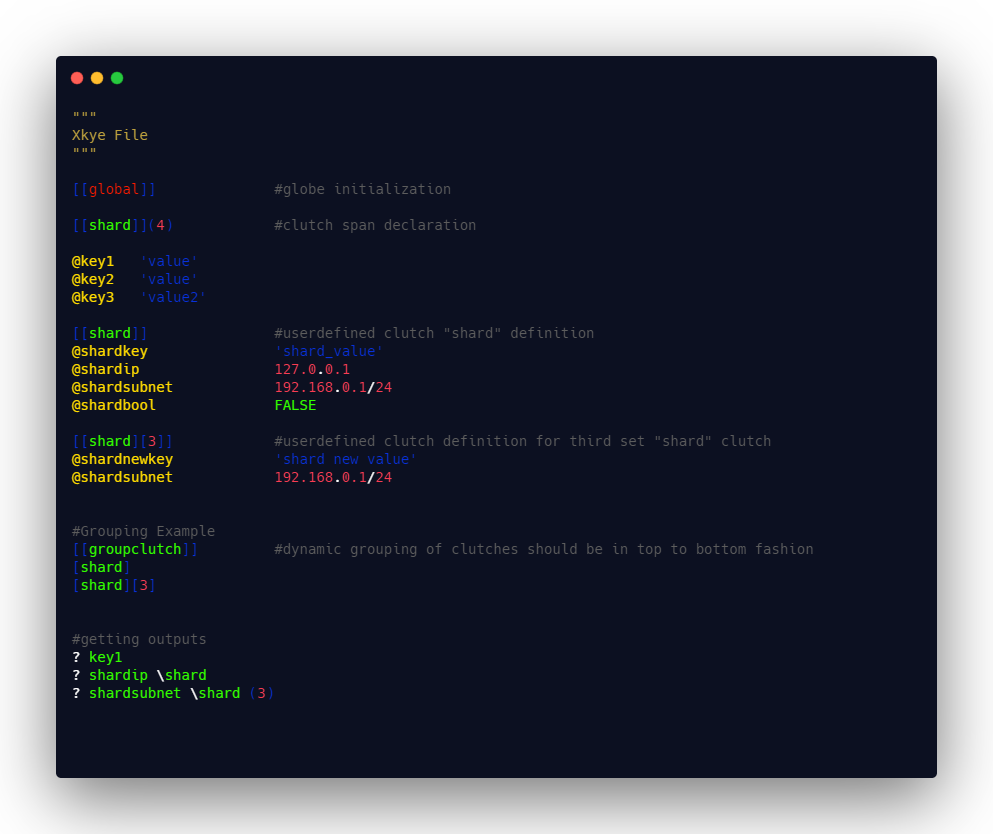

# Globe
Globe is the universal clutch and the only reserved keyword in Xkye language. everything between a globe clutch and the next user defined clutch will be under clutched under globe. Global clutch can be defined only at the start of the document.

```sh
[[global]]
#....
#rest of the file
```

Format of the overall Xkye file must as below

- Global clutch
- Clutch / subclutch span set declaration
- Clutch span definition
- Sub clutch definition
- Fetch


