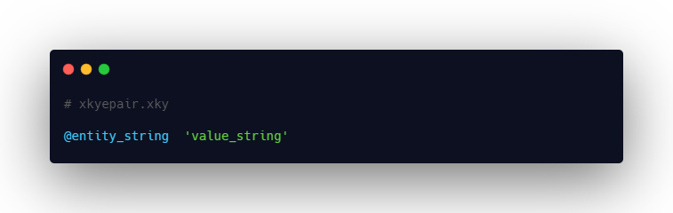
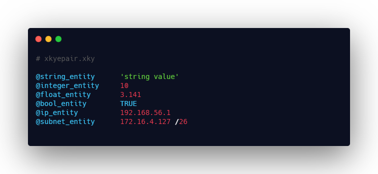

# Xkye Pair

The basic structure of a Xkye pair consists of an entity and a value assigned to it separated by a space or tab.

Please find the Xkye pair example below

## Entity
An entity is a case sensitive alphanumerical string which precedes with @ symbol.

### Rules

- No length constraints
- Entity string can contain alphanumerical characters only
- Each entity string must start only with a alphabet
- No special characters are allowed except underscore '_'
- Entity string is case sensitive and it can accept only lowercase characters

## Value
An value can be a one of the allowed variable string as listed Below

- String variable, it should be enclosed within single quotes and ***double quotes are not allowed***.
- Integer, no quotes required
- Float, no quotes required
- Boolean, it should be either TRUE or FALSE. No quotes required
- IP, should be a valid ipv4 address, ***IPV6 is not supported yet***
- SUBNETS, should be a valid ipv4 subnet address

## Xkye Pair

Valid syntax of Xkye pairs are given below. Different ways of getting output in Xkye is explained in [Fetch]()

